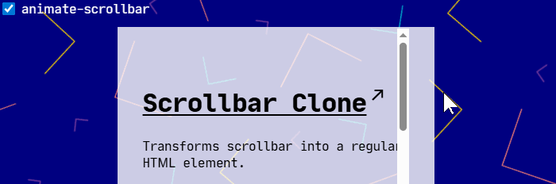

# Scrollbar Clone



[](https://www.npmjs.com/package/scrollbar-clone)

Lightweight web component that allows scrollbar to have custom margins, positioning, etc.  
It effectively transforms the scrollbar into a regular HTML element

```html
<scrollbar-clone
    origin-selector=".with-scrollbar-clone"
    disable-scroll="false"
    show-origin-scrollbar="false"
    style="height: 500px;"
/>
```

Examples:

- [Page scrollbar demo](https://yakunins.github.io/scrollbar-clone/demo1.html)
- [Three-column layout demo](https://yakunins.github.io/scrollbar-clone/demo2.html)
- @codesandbox.io: <a href="https://codesandbox.io/p/sandbox/m5mjh4">scrollbar position example</a>

## Project structure

```
packages/
├── scrollbar-clone/          # Web component (npm: scrollbar-clone)
├── react-scrollbar-clone/    # React wrapper (npm: react-scrollbar-clone)
└── config/
    ├── eslint/               # Shared ESLint configs
    └── tsconfig/             # Shared TypeScript configs

apps/
└── storybook/                # Storybook dev environment & demos
```

- **`packages/scrollbar-clone/`** — core vanilla web component, zero dependencies
- **`packages/react-scrollbar-clone/`** — thin React wrapper that re-exports the web component as a React element
- **`packages/config/`** — internal shared tooling configs (not published)
